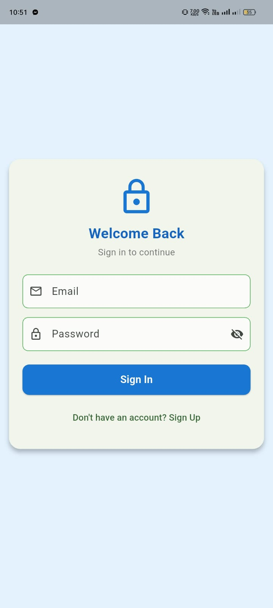
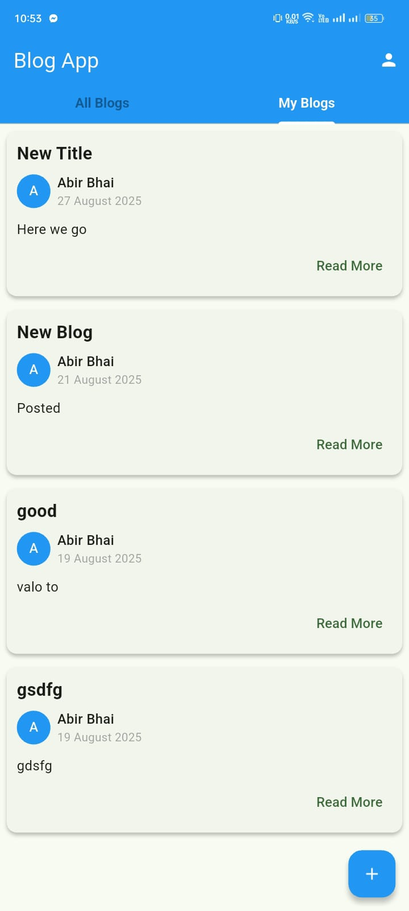
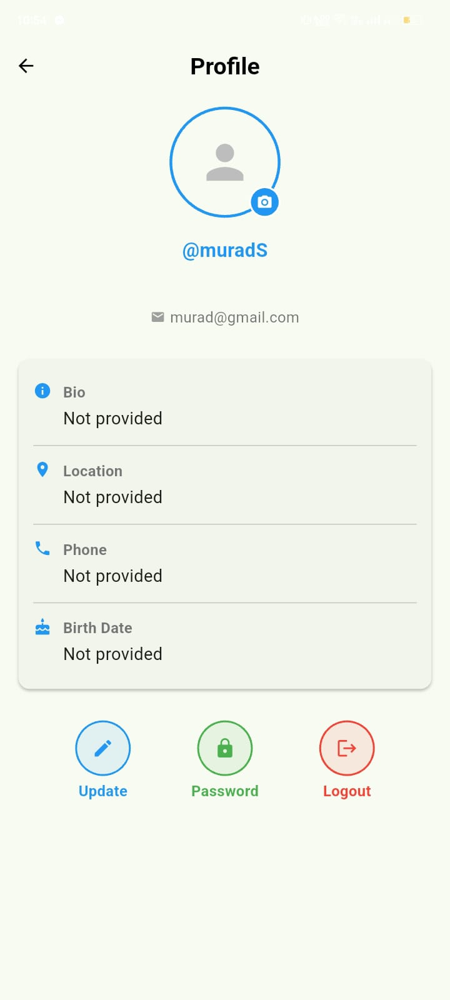

# 📖 Blog App  

A Flutter-based Blog application with **authentication, profile management, and blog content fetching** from REST API.  

## 🚀 Features  
- 🔑 User Authentication (Login, Signup, Refresh Token)  
- 👤 User Profile Update (Name, Bio, Location)  
- 📝 Fetch & Display Blogs from REST API  
- 📱 Responsive UI for Android & iOS  

## 🛠️ Tech Stack  
- **Flutter** (Frontend)  
- **Dart** (Programming Language)  
- **REST API** (Backend Communication)  
- **http Package** (API calls)  

## 📷 Screenshots  
 ### 🔑 Login Page  


### 📝 Blog List Page  


### 👤 Profile Page  



## ⚙️ Installation  

1. Clone the repo  
   ```bash
   git clone https://github.com/your-username/blog-app.git
2. Navigate to the project folder
   ```bash
   cd blog-app
4. Install dependencies
   ```bash
   flutter pub get
5. Run the App
   ```bash
   flutter run
